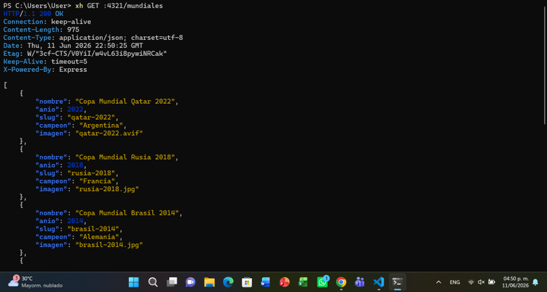
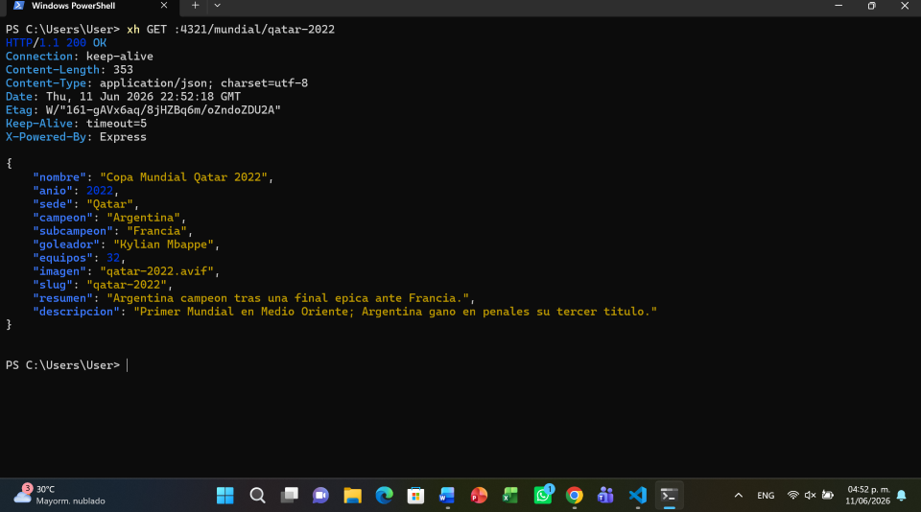
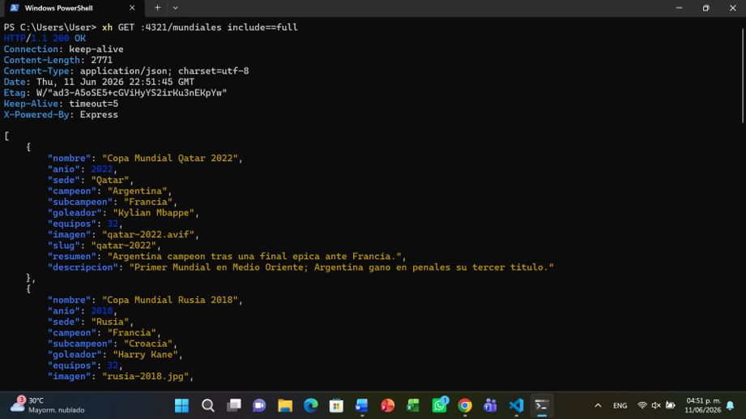
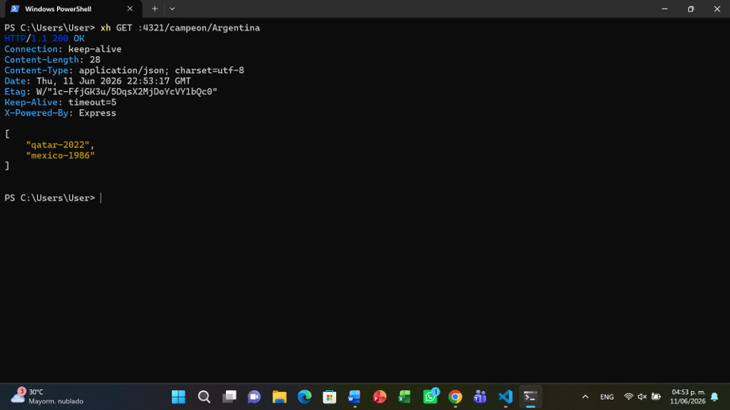
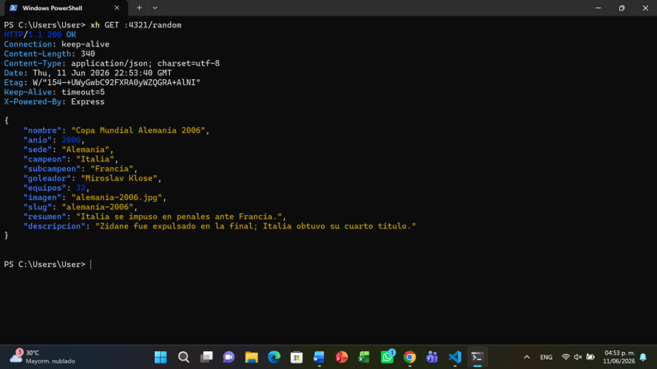
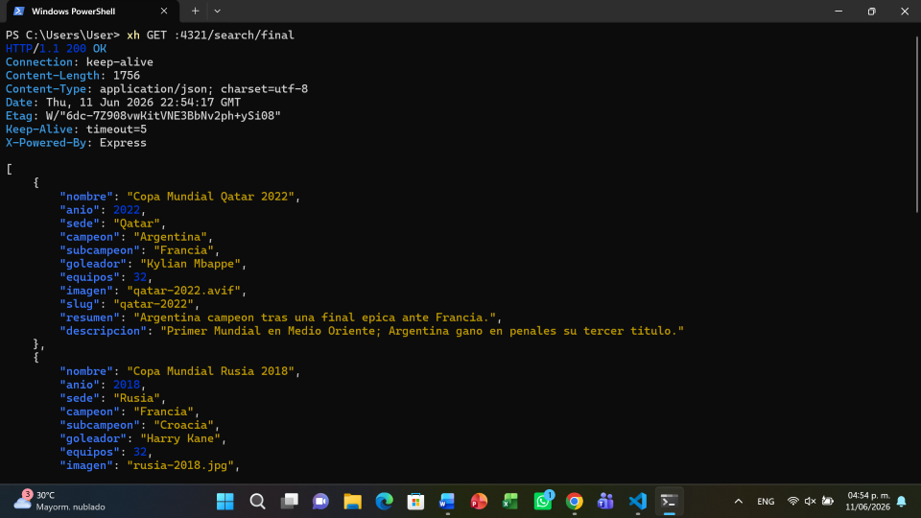
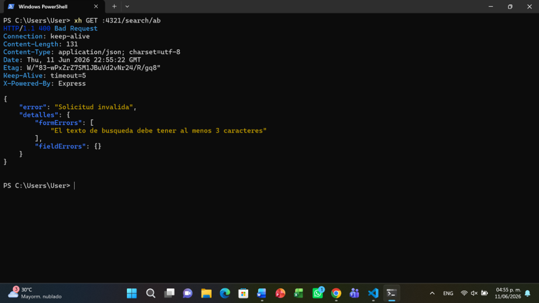
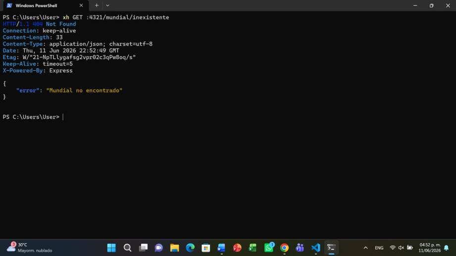

# Pruebas de la API

Documentacion de las pruebas manuales con [xh](https://github.com/ducaale/xh).

## Comandos de prueba

| Comando | Resultado esperado |
|---------|-------------------|
| `xh GET :4321/mundiales` | 200 - lista resumida |
| `xh GET :4321/mundiales include==full` | 200 - lista completa |
| `xh GET :4321/mundial/qatar-2022` | 200 - detalle del mundial |
| `xh GET :4321/mundial/inexistente` | 404 - JSON con error |
| `xh GET :4321/campeon/Argentina` | 200 - slugs ganados |
| `xh GET :4321/random` | 200 - edicion aleatoria |
| `xh GET :4321/search/final` | 200 - resultados de busqueda |
| `xh GET :4321/search/ab` | 400 - texto menor a 3 caracteres |

## Capturas

A continuación están las capturas de las pruebas realizadas con `xh` en la API:

